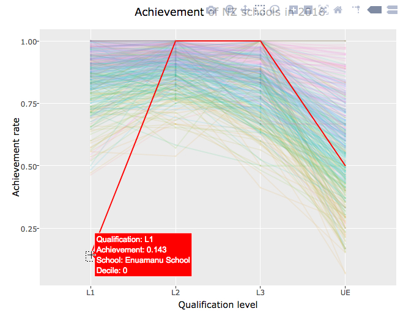
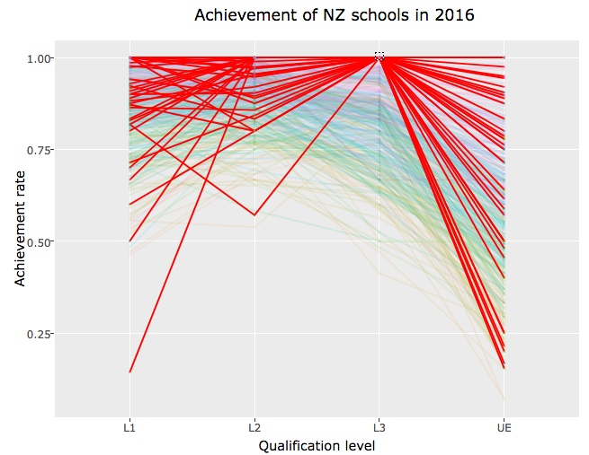
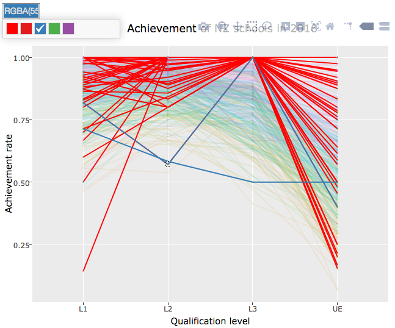

```{r setup, include=FALSE}
knitr::opts_chunk$set(echo=FALSE, warning=FALSE, message=FALSE)
# For tidying of NCEA data
library(tidyr) 
library(dplyr)
# For reading xls binary file for 2016 schools data
library(gdata)
# For plots
library(GGally)
# For interactivity
library(plotly)
library(shiny)
library(crosstalk)
```

## Introduction

(Some of the initial parts will be edited from last time).

The focus of analysis will be on the Auckland subset because it is less affected by the unreliability of small sample sizes. The NZQA indicator of a "small" cohort was at a very low threshold of fewer than five candidates for any qualification level. Being the most populated city in New Zealand, Auckland has many of the larger schools, but there may still be some schools left in the analysis that have less than 30 candidates entered in a qualification level. The first few observations from the data set of 91 schools in the Auckland region are shown below.

```{r}
nzqa2016 <- read.csv("http://www.nzqa.govt.nz/assets/Studying-in-NZ/Secondary-school-and-NCEA/stats-reports/2016/Qualification-Statistics-School-2016-29032017.csv")
# Drop vars that will not be used (eg. cumulative achievement)
nzqa2016 <- nzqa2016[,-c(1,8,10)]
names(nzqa2016) <- c("Decile", "Region", "School", "Year", "Qualification", "Achieve_participate", "Achieve_roll", "Small_sch")
levels(nzqa2016$Qualification) <- c("L1", "L2", "L3", "UE")
# Subset to use only Year 11 with Level 1, etc
nzqa <- nzqa2016 %>% filter(((Qualification=="L1") & (Year==11)) | 
                          ((Year==12) & (Qualification=="L2")) |
                          ((Year==13) & (Qualification=="L3")) | 
                          ((Year==13) & (Qualification=="UE"))) %>%
  # Reshape so that each row represents an observation (a school)
  # Current.Achievement.Rate.Participation kept for analysis only
  spread(Qualification, Achieve_participate, fill=0) %>%
  group_by(School) %>%
  summarise_at(c("L1", "L2", "L3", "UE"), sum) %>%
  inner_join(nzqa2016[, c(1, 2, 3, 8)]) %>% # Add Decile and Region and Small_sch variables
  distinct() %>% 
  filter(!((L1==0)&(L2==0)&(L3==0))) #Remove schools with 0% achievement rate for all levels

# Function to replace 0% with NA
zeros <- function(col) {
  replace(col, col==0, NA)
}

nzqa[2:5] <- sapply(nzqa[2:5], zeros)
# Remove schools with 'small cohort' warning (obscures pattern in non-small cohorts).
nzqa <- nzqa[nzqa$Small_sch=="",] # 439 school left
nzqa <- nzqa[, -8] # Remove Small_sch var
# Remove schools with any NA values 
nzqa <- nzqa[complete.cases(nzqa),] # 408 NZ schools
nzqa$Decile <- as.factor(nzqa$Decile)
# Subset Auckland schools only
akl <- as.data.frame(nzqa[nzqa$Region=="Auckland", -7]) # 91 AKL schools
rownames(akl) <- akl$School # Need for tooltips in tour
head(akl[-1], n=3)
```

#### Static visual analysis

(Analysis same as last time)

##### Figure 1: Pairs plot for NCEA data on Auckland schools
```{r}
panel.cor <- function(x, y, digits = 2, prefix = "", cex.cor, ...)
{
    usr <- par("usr"); on.exit(par(usr))
    par(usr = c(0, 1, 0, 1))
    r <- cor(x, y)
    txt <- format(c(r, 0.123456789), digits = digits)[1]
    txt <- paste0(prefix, txt)
    if(missing(cex.cor)) cex.cor <- 0.8/strwidth(txt)
    text(0.5, 0.5, txt, cex = cex.cor * r)
}
#pairs(akl[-1], upper.panel=panel.cor)
pairs(akl[-1], lower.panel=panel.cor)
```

##### Figure 2: Univariate distributions for NCEA data on Auckland schools

```{r}
NCEA_hist <- function(x, title) {hist(x, xlab="Achievement rate", main=title)}
layout(matrix(1:4, byrow=1, ncol=2))
NCEA.hists <- mapply(NCEA_hist, akl[2:5], colnames(akl[2:5]))
```

#### Multivariate visual representations

The pairs plot in Figure 2 provided a glimpse into the multivariate distribution of achievement rates across the four qualification levels. The parallel coordinates plot (PCP) shown below in Figure 3 allows us to further compare the multivariate distributions of achievement rates for different decile groups, as well as identify high dimensional clustering and outliers.

The ordering of axes in a PCP greatly affects the quality of the graphical analysis, hence interactivity that enables reordering of axes is recommended (Unwin, 2015). In the case of the NCEA data, the natural ordering of the four qualification levels by difficulty, conincides with the recommendation from Cook and Swayne (2007) to order the axes based on correlation. In addition, Unwin (2015) highlights the layering of colours also needs to be considered carefully, since the last group assigned a colour will dominate the other lines.

The positive relationships previously identified in the pairs plot, should translate to approximately horizontal lines between the parallel axes in the PCP, as opposed to sloped lines or "criss-cross" patterns for negative correlation. The static plot in Figure 3 questions whether the positive relationships hold true for Auckland schools with low achievement rates and in some decile groups. In particular, there appears to be a negative relationship between achievement rates at L3 and UE for many schools. The achievement rates for UE are clearly the most variable.

The higher decile schools in Auckland appear to dominate the high achievement rates across all qualification levels, while lower decile schools are less consistent with each other in terms of their performance across the levels. Although there are only 91 observations (lines), it is quite difficult to identify even "ball park boundaries", on the 11-point decile scale, to distinguish between "higher" and "lower" decile schools when describing possible patterns.

##### Figure 3: Parallel coordinates plot for NCEA data on Auckland schools
```{r}
# Transform data frame to plot PCP
ggpcp <- function(df, a=1, sd.group=NULL) {
  # Transform df
  long <- data.frame(School=rep(df$School, 4),
                     Decile=rep(df$Decile, 4),
                     Qualification=do.call(c, lapply(c("L1", "L2", "L3", "UE"), rep_len, nrow(df))),
                     Achievement=c(unlist(c(df[c("L1", "L2", "L3", "UE")]))))
  # Static PCP
  pcp.static <- long %>% SharedData$new(key=~School, group=sd.group) %>%
  ggplot(aes(x=Qualification, y=Achievement, group=School, colour=Decile)) +
    geom_line(alpha=a) +
    geom_point(alpha=a, size=0.01) +
    labs(x="Qualification level", y="Achievement rate")
  return(pcp.static)
}

ggpcp(akl) + ggtitle("Achievement of Auckland schools in 2016")
```

The following two plots demonstrate how alpha blending can help minimise the effects of overplotting as the number of observations increase. It is easier to check whether the patterns identified in Auckland schools extend to the 408 schools across New Zealand, using Figure 5 where alpha blending is applied, rather than Figure 4. The performance of high achieving lower decile schools is less "drowned out" by the dominance of their higher decile counterparts, when alpha blending is used. Figure 5 reveals a group of schools converging at 100% achievement for L3, but with varying levels of success at L2 and UE. It would be of interest to compare the achievement rates of these schools across the qualification levels. Similarly, we would be interested in tracking the performance of the school with the lowest achievement rate at L1. The school appears to make a convincing recovery in performance at L2, but it is impossible to follow its progress further in a static PCP due to overplotting. Interactive techniques will be later used to explore these points of interest.

##### Figure 4: Parallel coordinates plot without alpha blending
```{r, echo=FALSE}
ggpcp(nzqa) + ggtitle("Achievement of NZ schools in 2016")
```

##### Figure 5: Parallel coordinates plot with alpha blending
```{r}
nz.pcp <- ggpcp(nzqa, a=0.5, sd.group="NZpcp") + 
  ggtitle("Achievement of NZ schools in 2016")
nz.pcp
```

#### Leveraging static plots with interactivity

Although one of the strengths of a PCP is in identifying multivariate features, such as outliers (Cook & Swayne, 2007), the static plots in Figures 4 and 5 do not allow these features to be explored, due to overplotting. The use of colour and interactive techniques are recommended for maximising the effectiveness of a PCP. Venables and Ripley (2002) argue parallel coordinate plots are "often too 'busy' without means of interaction" (p. 315). The interactive filtering feature in Figure 6 overcomes the problems caused by overplotting and allows the user to isolate the distribution of each decile group (via a double-click on the legend). Furthermore, using the mouse to drag-and-select points on the parallel axes, brushes and links the acheivement rates of individual schools across all qualification levels. Lastly the hovering tooltip enables instant identification of indvidual schools by name.

##### Figure 6: Parallel coordinates plot with interactivity

```{r, fig.width=10, fig.height=7}
# Interactive
ggplotly(nz.pcp, tooltip=c("group", "colour", "x", "y")) %>%
  highlight(on="plotly_select", off="plotly_deselect", color = "red",  persistent=T, dynamic=T)
```

Figure 7 demonstrates the use of interactive techniques to explore the outlier at L1, previously identified in Figure 5. The tooltip identifies the school and the linked brushing reveals that despite its poor performance at L1, the school had 100% achievement rates at L2 and L3. 

##### Figure 7: Linked brushing to explore outliers


Cook and Swayne (2007) describe how linked brushing enables dynamic database querying and direct comparisons between subsets of data and the general distribution. Figure 7 illustrates how brushing the point where `L3=100%` on the interactive PCP, highlights the extent of the variability in performance at the other qualification levels. Surprisingly, the distribution of UE achievement rates for schools with 100% achievement at L3, is just as spread out as the overall performance of New Zealand schools in the data set. Many of these schools also obtained 100% achievement rates at L2, but again there is surprisingly variable success at L1.

##### Figure 8: Linked brushing to explore group of interest


The query made via linked brushing in Figure 7 is similar to subsetting the data using the code shown below. A summary could be used to examine the performance of the subset of 42 schools across the other qualifications, but making sense of this summary would required comparison with statistics for the whole data set. Furthermore the summary hides the unusual performance of individual schools at certain qualification levels. The interactive techniques allowed us to gain insights about the NCEA data, that would have been difficult to ascertain from static plots or numeric summaries alone.

```{r, echo=TRUE}
L3all_achieve <- nzqa[nzqa$L3==1, c("L1", "L2", "UE")]
nrow(L3all_achieve)
summary(L3all_achieve)
```

However the ease and effectiveness of linked brushing can also be affected by overplotting. Figure 9 demonstrates how an attempt to use persistent brushing to identify the UE success rate of the school with 100% achievement at L3, but unusually low performance at L2, results in accidentally brushing an observation with a similar L2 achievement rate. The `plotly` R package used in Figure 6 allows observations to be "brushed" via the drag-and-select motion (that was used), or a mouse click. Only the latter enables the brushing of individual lines on a PCP and the two options cannot be made concurrently available on the same plot.  The `ggobi` graphical user interface (GUI) applies the same drag-and-select motion to brush both points and lines on a PCP (Cook & Swayne, 2007). This greater flexibility would have avoided the issues caused by overplotting in this case, but some of the challenges of large data sets on static graphical displays will persist, even with interactive techniques. In particular the speed of rendering displays for large data sets determines whether the techinques can be applied "fast enough to be considered interactive" (Unwin 2015, p.20).

##### Figure 9: Challenges of linked brushing due to overplotting


The PCP in Figure 3 suggests that patterns of performance across decile groups, if they exist, are difficult to distinguish at the multivariate level for Auckland schools. Principal component analysis (PCA) provides a way to reveal interesting multivariate structure, through finding projections of the data that show maximal variability (Venables & Ripley, 2002). 

A plot of the first two principal components of the Auckland schools dataset is shown in Figure 7. The decile of the schools is represented by the colour and plotting symbol. The axes for the original variables, reflecting the loadings of the principal components, indicate that the first principal component considers the schools' performance across all four qualification levels, while the second principal component contrasts performance in UE against the remaining qualifications. Not surprisingly the plot shows more spread across the first principal component since it explains a much greater proportion of the variation in the data. The first principal component reveals a division between the majority of schools and a smaller group, that is positioned away from the variable axes shown. We can see the smaller group of schools are decile five and below, except for one decile nine school. There is also a decile ten school that appears to be unusual when examining both principal components. The use of colour highlights the remaining decile nine and ten schools as similar in performance, as weighted by the principal components. On the other hand schools from the other deciles seem to be more spread out from each other.

##### Figure 9: First two principal components for Auckland schools
```{r}
# Static PCA plot
# Function for PCA and plot
# scale.factor is an arbitary value that scales the loadings axes so that they can be on a comparable scale as the standardised PCs (scores). 
# nudge argument also depends on the range of PC1 (used for enhancing the legibility of text labels on loadings axes).
ncea_PCA <- function(df, scale.factor=20, nudge=-0.2, decile.pch=T, gp="Decile", sd.group=NULL) {
  # Perform PCA
  pca <- prcomp(df[2:5], scale.=T)
  # Explained variance
  exp.var <- round(pca$sdev^2/sum(pca$sdev^2)*100, 1)
  # Scores (rotated principal components)
  scores <- data.frame(t(t(pca$x[, 1:2])*(pca$sdev[1:2]^-1)), df[-(2:5)], Group=df[, gp])
  scores$Decile <- as.factor(df$Decile)
  axis.limit <- c(-round(max(abs(scores[1:2])), 1), round(max(abs(scores[1:2])), 1))
  # Set up for linked brushing for Fig 8
  sdPCA <- SharedData$new(scores, key=~School, group=sd.group)
  # Variable axes (loadings)
  lambda <- pca$sdev[1:2]/sqrt(nrow(df)-1)
  loadings <- data.frame(varnames = rownames(pca$rotation),
                              t(t(pca$rotation[, 1:2])*lambda*scale.factor))
  # Plot of first two PCs
  p <- ggplot(loadings) + 
    geom_segment(aes(x=0, y=0, xend=PC1, yend=PC2), colour="grey35") +
    geom_text(aes(x=PC1, y=PC2, label=varnames), colour="grey35", nudge_x=nudge) +
    labs(x=paste("PC1 (", exp.var[1], "% explained var.)", sep=""),
         y=paste("PC2 (", exp.var[2], "% explained var.)", sep="")) +
    scale_x_continuous(limits=axis.limit) +
    scale_y_continuous(limits=axis.limit*1.1) +
    theme(
      panel.border = element_rect(colour="grey", fill=NA),
      panel.background = element_blank(),
      legend.position = "none",
      axis.text=element_blank(),
      axis.ticks=element_blank())
  # Plot decile as character or colour by another variable
  if (decile.pch) {
    plot <- p + geom_text(data=sdPCA, aes(x=PC1, y=PC2, label=Decile, colour=Decile, label1=School))
  } else {
    plot <- p + geom_point(data=sdPCA, aes(x=PC1, y=PC2, colour=Group, label1=School))
  }
  return(plot)
}
# Static plot
ncea_PCA(akl) + ggtitle("Achievement of Auckland schools in 2016")
```

The principal components plot in Figure 7 provided a view of the multivariate distribution of the Auckland schools dataset that was less easily affected by overplotting than a static PCP. Hence refinements on observations were possible. From the parallel coordinate plots we observed that "higher" decile schools performed more consistently with each other and dominated across the four qualification levels, but it was difficult to quantify the decile "cut off" for such schools. The PCA suggests these are the decile nine and ten Auckland schools, with the exception of two schools. One cannot help but wonder: Who are the two unusual decile nine and ten Auckland schools? The interactive tooltips in Figure 8 instantly satifies this curiosity and hence demonstrates the usefulness of being able to directly identify unusual observations. The linked brushing between visual representations of the PCA model and the original variables, also confirms previous observations and supports a better understanding of the PCA model.

```{r}
# Function for linked factor plot
ncea_factor <- function(df, gp="Decile", sd.group="AKLncea") {
  # Set up for linked brushing 
  sdGroup <- SharedData$new(data.frame(df, Group=df[, gp]), key=~School, group=sd.group) 
  # Static plot
  factor.p <- ggplot(sdGroup) +
    geom_jitter(aes(y=Group, x=1, colour=Group, label=School), width=0.1, height=0) +
    labs(x=as.character(gp), y="") +
    scale_x_continuous(limits=c(0.7, 1.3)) +
    theme(
      panel.border=element_rect(colour="grey", fill=NA),
      panel.background=element_blank(),
      legend.position="none",
      axis.text.x=element_blank(),
      axis.ticks.x=element_blank())
  # Interactive linked plot
  link.factor <- ggplotly(factor.p, tooltip=c("colour", "label"))
  return(link.factor)
}
```

##### Figure 8: First two principal components for Auckland schools with interactivity
```{r}
# Linked brushing of PCA and decile plot
akl.PCA <- ncea_PCA(akl, decile.pch=F, sd.group="AKLncea") + 
  ggtitle("Achievement of Auckland schools in 2016")

# Link PCA plot
link.PC <- ggplotly(akl.PCA, tooltip=c("label1")) 

# Link decile plot
link.decile <- ncea_factor(akl) %>%
  layout(yaxis=list(side="right"), margin=list(r=30))

subplot(link.PC, link.decile, widths=c(0.7, 0.3), margin=0, titleX=T, titleY=T) %>%
  layout(dragmode="select") %>%
  highlight(on="plotly_select", off="plotly_deselect", color="blue", persistent=T)
```

```{r}
# Link with PCP
AKL.pcp <- ggpcp(akl, sd.group="AKLncea")
# Interactive
ggplotly(AKL.pcp, tooltip=c("group", "colour", "x", "y")) %>%
  layout(dragmode="select", showlegend=FALSE) %>%
  highlight(on="plotly_select", off="plotly_deselect", color = "blue", persistent=T, dynamic=T)
```

#### NZ schools (this part is still more of a draft)
Data on school size by year group and ethnicity for 2016, was obtained from the government website, Education Counts (2017). 
```{r, eval=FALSE}
# Download file on school demographics (includes counts by Year group)
download.file("https://www.educationcounts.govt.nz/__data/assets/excel_doc/0005/152609/Student-rolls-by-School-2010-2016.xlsx", "schools.xlsx")
# Takes a long time to extract 2016 data
schools2016 <- read.xls("schools.xlsx", sheet="2016", skip=2, header=T)
# Subset relevant variables
schools2016 <- schools2016[c(2, 4, 10, 13:18, 34:36)]
# Tidy up variable names
colnames(schools2016)[9] <- "EuropeanPakeha"
colnames(schools2016)[4] <- "Maori"
# Keep only schools with secondary level students
schools2016 <- schools2016 %>%
  filter(!((Type=="Full Primary")|(Type=="Intermediate")))

# Merge with NZQA data 
# School ID number not available on NZQA data and some names have changed
# (eg. Auckland Grammar)
levels(schools2016$School.Name) <- c(levels(schools2016$School.Name), "Auckland Grammar School")
schools2016[schools2016$School.Name=="Auckland Grammar", 1] <- "Auckland Grammar School"
nzqa.sch <- merge(nzqa, schools2016, by.x="School", by.y="School.Name") # 348 schools left
# Change ethinicity counts to proportions
# MELAA refers to Middle Eastern/Latin American/African
nzqa.sch[10:15] <- sapply(nzqa.sch[10:15], function(x) {round(x/nzqa.sch$Total, 2)})
nzqa.sch$Other <- 1 - Reduce("+", nzqa.sch[c(10:13, 15)]) 
# Minimum cohort size for Yr 11 to 13
nzqa.sch$Min.Cohort <- sapply(1:nrow(nzqa.sch), function(x) {min(nzqa.sch[x, 16:18])})
nzqa.sch <- droplevels(nzqa.sch)
save(nzqa.sch, file="nzqa.sch.RData")
```

The minimum cohort size for Year 11, 12 and 13 will be used as indicator of whether the achievement rates are based on small sample sizes. 
```{r}
# Load merge school data
load("nzqa.sch.RData")
nzqa.sch$Decile <- as.factor(nzqa.sch$Decile)
summary(nzqa.sch$Min.Cohort)
summary(nzqa.sch[16:19])
```

As expected we see less spread in the PCA plot as the minimum cohort size is increased and the first principal component is able to explain more of the variation in the data. The biggest drop in unexplained variability occurs when the minimum cohort size is increased from 10 to 20. Once beyond 20 the variability in achievement rates continues to decrease but at a slower rate. The positions of the axes (loadings) remain reasonably consistent with the first principal component being a measure of overall performance and the second component contrasting L1 and L2 preformance against L3 and UE. 

The decile patterns previously noted for Auckland schools, where decile nine and ten schools are more consistent with each other in performance than other deciles, appear to hold for New Zealand schools in general, as we vary the minimum cohort size considered. 

When the minimum cohort size is set at 100, the PCA plot appears quite similar to the plot for Auckland schools but with fewer schools from decile one. We can verify this quickly by using the interactive drop-down menu to choose the variable "Region" and then brush the group of Auckland schools. The drop-down menu also allows us "cycle through" the other variables, to verify whether there are any underlying structures in achievement rates related to variables other than decile, that are worth further investigation.

##### Figure ?: Achievement of NZ schools in 2016 with interactivity
```{r}
inputPanel(
  selectInput("group", "Select variable", choices=as.list(colnames(nzqa.sch)[6:15]), selected="Decile"),
  div(style="width: 600px;", sliderInput("cohort2", label="Minimum size of Year 11, 12, 13 cohorts", min=0, max=100, step=10, value=0, animate=T))
)

output$plots <- renderPlotly({
  # Unique SharedData group depending on variable chosen
  sd_group <- paste(input$group, "ncea", sep="")
  # Static PCA plot
  PCA <- ncea_PCA(subset(nzqa.sch, Min.Cohort>=input$cohort2), decile.pch=F, gp=input$group, scale.factor=50, sd.group=sd_group) 

  # Link PCA plot
  link.PCA <- ggplotly(PCA, tooltip=c("label1"))

  # Link group plot
  link.group <- ncea_factor(subset(nzqa.sch, Min.Cohort>=input$cohort2), gp=input$group, sd.group=sd_group) %>%
    layout(yaxis=list(side="right"), margin=list(r=150))
  
  subplot(link.PCA, link.group, widths=c(0.5, 0.5), margin=0, titleX=T, titleY=T) %>%
    layout(dragmode="select", autosize = F, width=1000, height=500) %>%
  highlight(on="plotly_select", off="plotly_deselect", color="red", persistent=T)
})

mainPanel(plotlyOutput("plots")) 
```

##### Alternatively could using min cohort size to explore standardised PCP
Explore whether conclusions about above and below average schools across deciles hold (eg. the spread in decile 1 schools due to small sizes?  Decile 5 really the "average school"?)
```{r}
nzqa.scale <- nzqa
nzqa.scale[2:5] <- scale(nzqa[2:5])
head(nzqa.scale)
pcp.scale <- ggpcp(nzqa.scale, a=0.5, sd.group="pcp_scale") + 
  geom_hline(yintercept=0, lty=2, colour="grey30") +
  ggtitle("Standardised achievement of NZ schools in 2016") +
  labs(x="Qualification level", y="Standard deviations")
ggplotly(pcp.scale, tooltip=c("group", "colour", "x", "y")) %>%
  highlight(on="plotly_select", off="plotly_deselect", color = "red",  
            persistent=T, dynamic=T)
```

